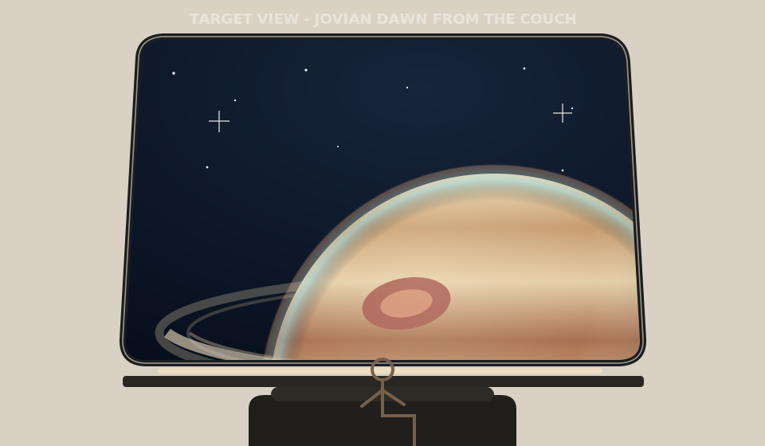
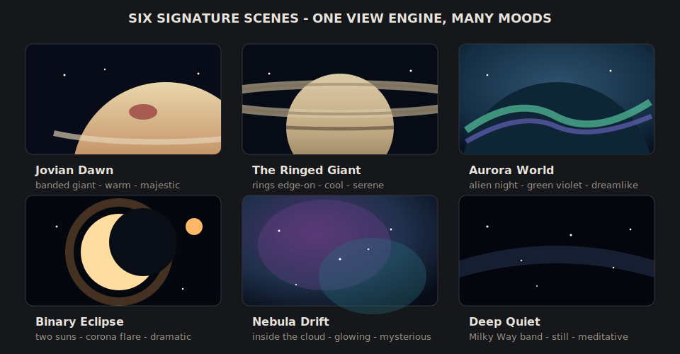
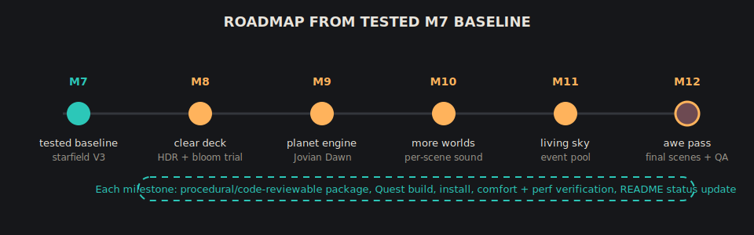
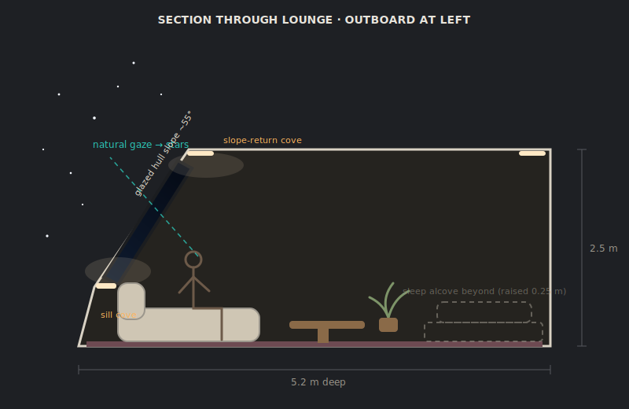
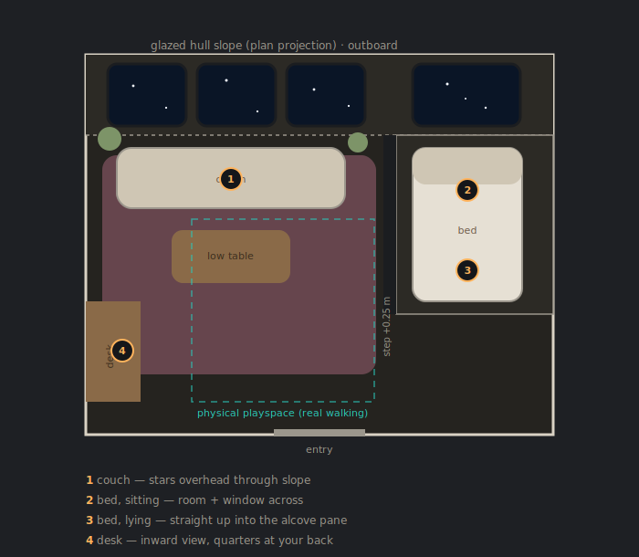
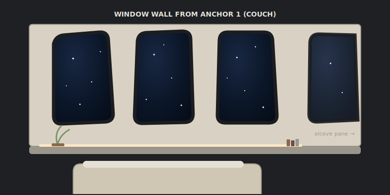
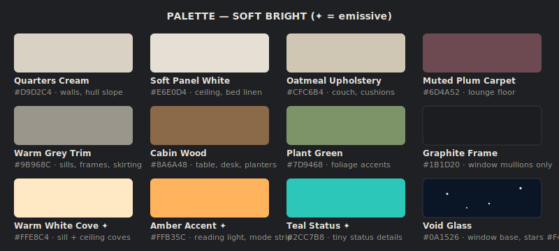

# Quest Starship Cabin

A small Unity/OpenXR relaxation cabin for Meta Quest, built for sideloaded immersive ambience.

The current prototype is a seated, comfort-first VR room with a forward starfield window, warm cabin lighting, simple procedural furnishings, and generated ambient audio. It is intended as an original optimistic sci-fi relaxation space, not a recreation of any copyrighted franchise.

## Current Status

Current tested build: `Quarters V2 Milestone 7`

Stable rollback tag: `quarters-v2-m7-tested-20260711`

- Commit: `6ae1bf3` (`Add Quarters V2 milestone 7: fitted book labels + starfield V3`)
- Tested on: Meta Quest 3
- Installed/launched on device: 2026-07-11
- Unity: 6000.5.2f1
- Package: `jp.openclaw.starshipcabin`
- APK SHA-256: `4e65a1df79b4cb87fa7d9512757c624d0d8625ce65a02f239c89c6c8137572d4`

The older `VisibleStars/Input V10` build is now a previous MVP baseline, not the current tested build.

### Implemented

- Native Quest APK build and sideload path proven.
- OpenXR immersive mode and Quest 3 head tracking working.
- Comfort-first seated baseline: no visible artificial translation; anchor hops fade to black.
- Procedural Crew Quarters V2 room shell with 55 degree glazed hull slope and four window panes.
- Furniture, palette, console strips, plants, chess/library decor, and fitted book labels.
- Seat anchors for couch, bed-sit, bed-recline, and desk.
- URP migration, baked cove lighting, and one mixed runtime light.
- Star shader V3 dark-sky view: point stars, diffraction spikes, halos, galactic band, dust lanes, warm/cool tints, filmic tone map, capped twinkle, shooting stars, nebula mode, and lateral motion.
- Ambient audio V2: layered engine bed, brown noise, air circulation, and softer panel beeps.
- Media/video wall from M5 exists in the M7 baseline, but is being retired in M8 because Quest system overlays can provide media apps without distracting from star-gazing.

### Roadmap Discipline

This README is the source of truth for what is implemented versus still roadmap. Each future milestone should update this section in the same commit that implements the feature.

## Design Direction: Crew Quarters V2 - The View

The next major iteration keeps the current room as the stable foundation and focuses tightly on visual awe and ambience. The goal is not more objects or room state. The goal is to make sitting in the cabin feel like being truly adrift in space, looking through the glass at something vast and beautiful.

The defining architectural move remains the steeply sloped glazed hull wall: the windows sit *in* the slope, so the starfield hangs above you from the couch, and lying on the bed you look straight up into space. The next roadmap adds a world in that view, destinations, a living sky, and per-world sound.

Movement uses seat anchors plus real walking: natural head-tracked walking within the playspace, and point-to-teleport hops (with a short fade, never visible translation) between couch, bed, and desk anchors. The seated, no-artificial-motion comfort baseline is preserved.

Full concept document: [`docs/design/quarters-concept-v2.html`](docs/design/quarters-concept-v2.html) (open locally in a browser).

### The View - target concept



### Destination moods



### Roadmap from M7



### Section — glass in the slope



### Plan — two zones, four perspectives



### The window wall from the couch



### Palette — soft bright



### Completed milestones

1. **Shell + glazing** — procedural room shell with 55° glazed hull slope, four rounded-trapezoid window frames, shader-based starfield (replaces the star-dot cubes and particle box).
2. **Furniture + palette** — couch, bed, alcove platform, desk, console strips, plants; soft bright material set.
3. **Seat anchors** — `SeatAnchorController`, fade transitions, four anchors (couch / bed-sit / bed-lie / desk).
4. **URP migration + baked lighting** — cove-lit baked GI, single runtime light, legacy cleanup.
5. **Audio V2 + media wall + star motion** — layered ambient bed, brown noise, lateral star motion, local video wall, and light fixes.
6. **Decor pass** — procedural chess set and library decor.
7. **Book labels + starfield V3** — fitted labels and the dark-sky star shader upgrade.

### Active roadmap

8. **Clear the deck + HDR trial** — retire the media/video wall, remove `MediaScreenController` and scene objects, enable HDR + bloom paired with fixed foveated rendering, then verify frame time on Quest before adding new geometry.
9. **Planet + destination engine** — add one hero world, `Jovian Dawn`: a banded gas giant with storm, terminator, atmospheric limb, rings, and slow destination switching.
10. **More worlds + per-scene sound** — add `The Ringed Giant`, `Aurora World`, and `Deep Quiet`; add per-world audio layers on top of the M5 ambient bed.
11. **Living sky** — extend the shooting-star system into a comfort-capped event pool: distant ships, comets, asteroids, moon transits, meteor showers, and aurora ripples.
12. **Awe pass** — add `Binary Eclipse`, `Nebula Drift`, a very rare `Leviathan` event, and a final comfort/perf verification sweep on device.

All geometry remains procedural C#; the design is code-reviewable. Original, generic sci-fi only — see the IP Boundary section below.

## Requirements

- Unity 6000.5.2f1 or a compatible Unity 6 editor
- Android Build Support
- Android SDK and NDK Tools
- OpenJDK
- Meta Quest 3 or compatible Quest headset
- Developer Mode enabled on the headset
- USB debugging authorized

## Project Layout

- `Assets/Scripts/` - runtime C# scripts for starfield, ambience, session logic, and XR input
- `Assets/Editor/` - editor automation for scene setup and Android APK build
- `Assets/Scenes/Cabin_Seated_MVP.unity` - older MVP scene
- `Assets/Scenes/Cabin_Quarters_V2.unity` - generated current Quarters scene after running the setup menu; not checked in
- `Assets/XR/` - Unity XR/OpenXR settings assets
- `Packages/` - Unity package manifest and lock file
- `ProjectSettings/` - Unity project settings
- `ROADMAP.md` - planned work

## Build

Open the project in Unity, then run:

`Starship Cabin -> Setup MVP Scene`

To build from the editor menu, use the included editor build tooling or call:

```bash
/Applications/Unity/Hub/Editor/6000.5.2f1/Unity.app/Contents/MacOS/Unity \
  -batchmode \
  -nographics \
  -quit \
  -projectPath "$PWD" \
  -executeMethod StarshipCabin.EditorTools.BuildStarshipCabin.BuildAndroidApk
```

The build output is:

`Builds/StarshipCabin-MVP.apk`

For the Quarters V2 milestone scene, run:

`Starship Cabin -> Setup Quarters Scene (V2)`

To build the Quarters APK from the editor menu, use `Starship Cabin -> Build Quarters APK`, or call:

```bash
/Applications/Unity/Hub/Editor/6000.5.2f1/Unity.app/Contents/MacOS/Unity \
  -batchmode \
  -nographics \
  -quit \
  -projectPath "$PWD" \
  -executeMethod StarshipCabin.EditorTools.QuartersSceneSetup.BuildQuartersApk
```

The Quarters build output is:

`Builds/StarshipCabin-Quarters.apk`

## Sideload

With the Quest connected and authorized:

```bash
adb install -r Builds/StarshipCabin-MVP.apk
adb shell monkey -p jp.openclaw.starshipcabin 1
```

For the current Quarters build:

```bash
adb install -r Builds/StarshipCabin-Quarters.apk
adb shell monkey -p jp.openclaw.starshipcabin 1
```

## IP Boundary

Do not add copyrighted franchise names, logos, interface layouts, sound effects, music, voice clips, meshes, or fan assets unless their license is explicit and compatible with this repository. Keep the project original and generic.

## License

MIT. See `LICENSE`.
