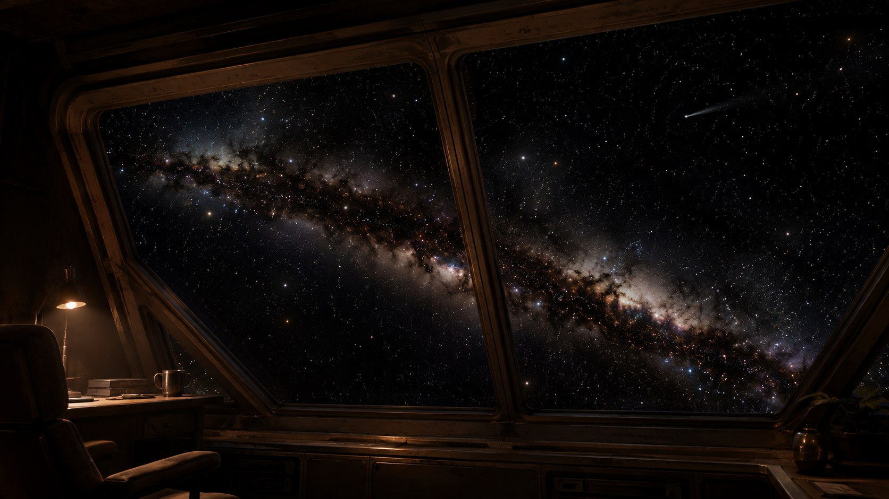
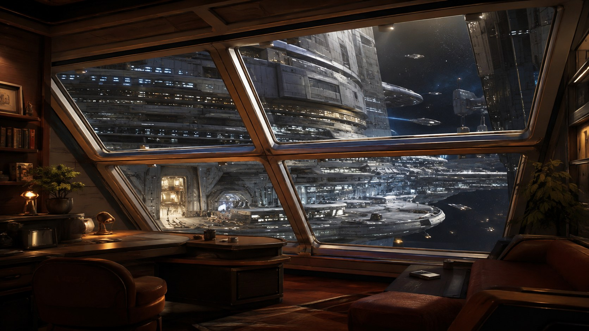
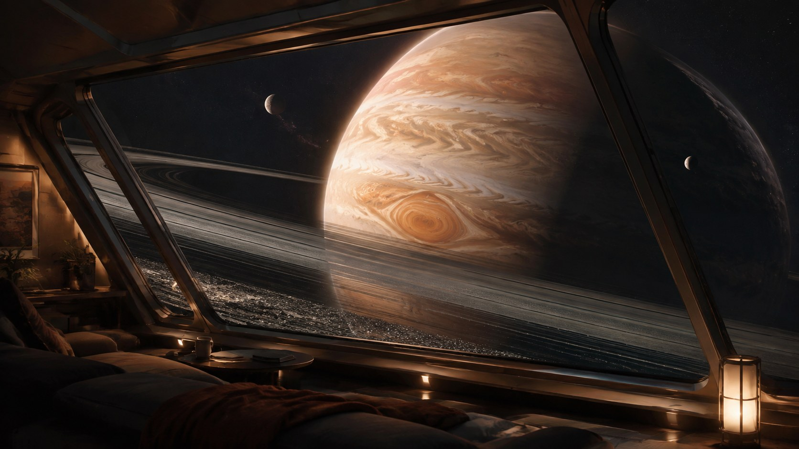
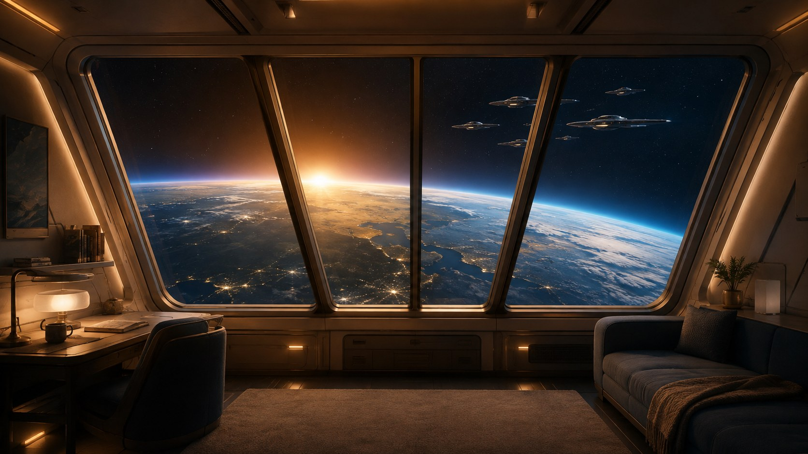
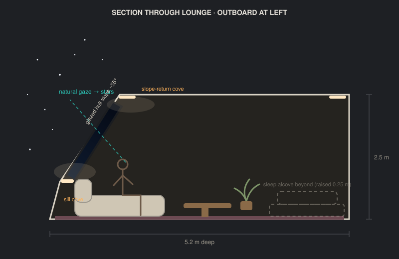
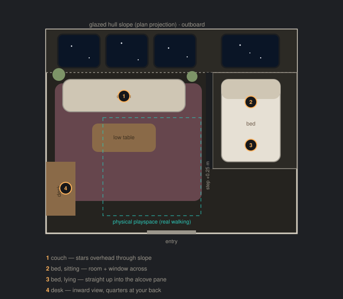
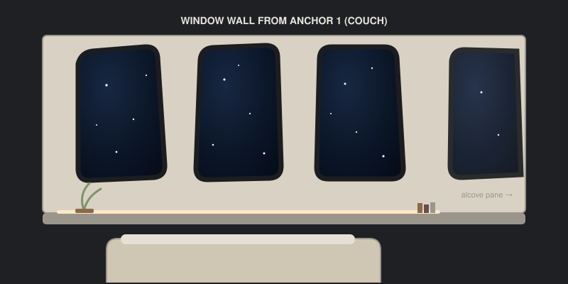
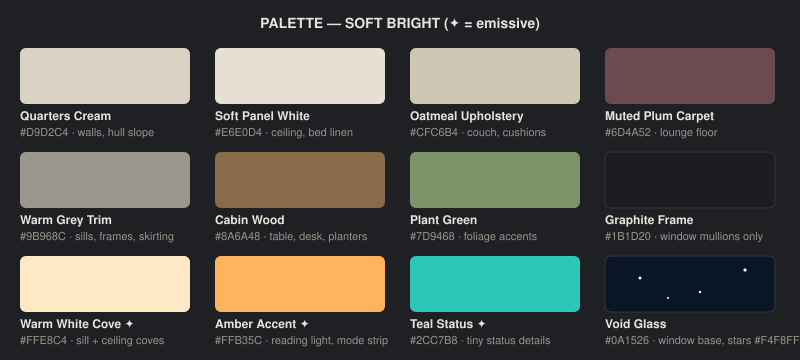

# Quest Starship Cabin

A small Unity/OpenXR relaxation cabin for Meta Quest, built for sideloaded immersive ambience.

The current prototype is a seated, comfort-first VR room with a forward starfield window, warm cabin lighting, simple procedural furnishings, and generated ambient audio. It is intended as an original optimistic sci-fi relaxation space, not a recreation of any copyrighted franchise.

## Current Status

Active development branch: `v2/quiet-watch`

- Foundation: tested Milestone 8 `main` commit `25e1d818`
- Direction: exterior-first 2.0 replacement vision
- Current branch status: M0 architecture and the M1 `First Question` playable are implemented; Quest installation is pending USB-debug authorization
- Historical experiments: `beta/m9-opus-fix` and `newhope` remain available for comparison but are not the 2.0 foundation

Current headset build: `Quarters V2 Milestone 8 rollback`

Stable rollback tag: `quarters-v2-m7-tested-20260711`

- Baseline rollback commit: `6ae1bf3` (`Add Quarters V2 milestone 7: fitted book labels + starfield V3`)
- Tested on: Meta Quest 3
- Installed/launched on device: 2026-07-12 18:33:05 JST
- Unity: 6000.5.2f1
- Package: `jp.openclaw.starshipcabin`
- APK SHA-256: `97ec2a0a804f8db99e34c300b920baaa5eed251c6ee5eef5a4c0905b1b0e768b`

The older `VisibleStars/Input V10` build is now a previous MVP baseline, not the current tested build.

### Quiet Watch first playable

Built and desktop-render validated on 2026-09-03 with Unity 6000.5.2f1:

- Product: `Starship Cabin - The Quiet Watch`
- Package: `jp.openclaw.starshipcabin.quietwatch`
- Version: `2.0.0-m1` (`20001`)
- APK: `Builds/StarshipCabin-QuietWatch-M1.apk`
- APK SHA-256: `e94391e2240b04d763b0265b2cef5e015ff3d4e0380d18555c3a633a44f49b46`
- Installation status: pending; the connected Quest was visible to ADB but had not re-authorized USB debugging

This first playable adds:

- A reusable `VistaEnvironment` lifecycle and deterministic `VistaDirector`.
- One shared comfort blackout owner for seat hops and future vista changes.
- Persisted vista, `Quiet`/`Living`, and `Still`/`Drift` choices.
- A restrained diegetic selector on the cabin table with controller shortcuts.
- Four named fixed-seat capture points and repeatable editor renders.
- Lightweight ten-second CPU/GPU/frame telemetry for `adb logcat` evidence.
- `The First Question`: a camera-ray-anchored deep-space field with galactic structure, dust, three stellar depth layers, colour variation, and true negative space.
- `Quiet` plus `Still` as the default; optional extremely slow drift; one deterministic comet after twelve minutes only in `Living` mode.

The selector currently contains one vista. The Harbour, Blue Morning, Great Weather, and Long Formation remain roadmap work, not hidden or inactive claims.

### Implemented

- Native Quest APK build and sideload path proven.
- OpenXR immersive mode and Quest 3 head tracking working.
- Comfort-first seated baseline: no visible artificial translation; anchor hops fade to black.
- Procedural Crew Quarters V2 room shell with 55 degree glazed hull slope and four window panes.
- Furniture, palette, console strips, plants, chess/library decor, and fitted book labels.
- Seat anchors for couch, bed-sit, bed-recline, and desk.
- URP migration, baked cove lighting, and one mixed runtime light.
- Star shader V3 dark-sky view: point stars, diffraction spikes, halos, galactic band, dust lanes, warm/cool tints, filmic tone map, capped twinkle, shooting stars, nebula mode, and lateral motion.
- Ambient audio V2: layered engine bed, brown noise, air circulation, and softer panel beeps.
- Media/video wall from M5 retired in M8 because Quest system overlays can provide media apps without distracting from star-gazing.

### Roadmap Discipline

This README is the source of truth for what is implemented versus still roadmap. Each future milestone should update this section in the same commit that implements the feature.

## Design Direction: Starship Cabin 2.0 — The Quiet Watch

The room is shelter. The view is vocation.

The next major iteration keeps the tested cabin as its stable foundation and rebuilds the exterior experience. The player is an off-duty starship officer returning to a warm private room after the mission. The view should restore awe, peace, and a sense of why this life was chosen.

Version 2.0 is five genuinely distinct living vistas rather than one planet with material presets:

- **The First Question** — stars only; curiosity
- **The Great Weather** — a dimensional ringed gas giant; wonder
- **The Long Formation** — original ships at rest; fellowship
- **Harbour of Ten Thousand Lights** — a colossal orbital station; belonging
- **Blue Morning** — an Earth-like horizon entering dawn; home

Each vista gets its own composition, scale ladder, lighting, sound, physical event logic, and comfort behaviour. Manual selection is immediate. Auto-tour is optional and off by default. Each normal session contains long stillness and at most one authored destination-specific grace note.

Full replacement vision:

- [The Quiet Watch — browser document](docs/design/the-quiet-watch.html)
- [The Quiet Watch — shareable PDF](docs/design/starship-cabin-2.0-the-quiet-watch.pdf)
- [Detailed implementation roadmap](ROADMAP.md)

The older [Crew Quarters V2 concept](docs/design/quarters-concept-v2.html) remains useful for cabin geometry and interior design, but no longer defines the exterior roadmap.

### Concept targets

These images establish composition, shelter, scale, light, and mood. They are art-direction targets, not gameplay screenshots or asset-fidelity promises.

#### The First Question



#### Harbour of Ten Thousand Lights



#### The Great Weather



#### Blue Morning and The Long Formation



### Existing cabin design references

#### Section — glass in the slope



### Plan — two zones, four perspectives



### The window wall from the couch



### Palette — soft bright



### Completed milestones

1. **Shell + glazing** — procedural room shell with 55° glazed hull slope, four rounded-trapezoid window frames, shader-based starfield (replaces the star-dot cubes and particle box).
2. **Furniture + palette** — couch, bed, alcove platform, desk, console strips, plants; soft bright material set.
3. **Seat anchors** — `SeatAnchorController`, fade transitions, four anchors (couch / bed-sit / bed-lie / desk).
4. **URP migration + baked lighting** — cove-lit baked GI, single runtime light, legacy cleanup.
5. **Audio V2 + media wall + star motion** — layered ambient bed, brown noise, lateral star motion, local video wall, and light fixes.
6. **Decor pass** — procedural chess set and library decor.
7. **Book labels + starfield V3** — fitted labels and the dark-sky star shader upgrade.
8. **Clear the deck + HDR trial** — retire the media/video wall, remove `MediaScreenController`, enable HDR + bloom, add fixed foveated rendering, and verify on Quest.

### Active 2.0 roadmap

0. **Clean break** — environment lifecycle, capture harness, frame-time evidence, and removal of weak/inactive 2.0 claims.
1. **The First Question** — rebuild stars-only space as the benchmark and ship the real selector. First playable built; Quest performance and comfort sign-off remain.
2. **The Harbour** — prove original station art direction and readable kilometre scale before building another planet.
3. **Blue Morning** — build the atmospheric view and validate `Still`/`Drift` comfort.
4. **The Great Weather** — replace the experimental gas giant with dimensional storms, rings, moons, and coherent light.
5. **The Long Formation** — build a dedicated fleet-at-rest composition with one authored formation turn.
6. **The Quiet Watch** — unify sound, light, persistence, timing, comfort, thermal performance, and release QA.

Every milestone ends with a regenerated APK, Quest installation, fixed-seat captures, frame-time evidence, and on-device review. Procedural code remains useful but is no longer a purity rule: compatibly licensed authored meshes, textures, matte layers, and baked assets are allowed when they materially improve the headset result.

Original, generic sci-fi only — see the IP Boundary section below.

## Requirements

- Unity 6000.5.2f1 or a compatible Unity 6 editor
- Android Build Support
- Android SDK and NDK Tools
- OpenJDK
- Meta Quest 3 or compatible Quest headset
- Developer Mode enabled on the headset
- USB debugging authorized

## Project Layout

- `Assets/Scripts/` - runtime C# scripts for starfield, ambience, session logic, and XR input
- `Assets/Editor/` - editor automation for scene setup and Android APK build
- `Assets/Scenes/Cabin_Seated_MVP.unity` - older MVP scene
- `Assets/Scenes/Cabin_Quarters_V2.unity` - generated current Quarters scene after running the setup menu; not checked in
- `Assets/XR/` - Unity XR/OpenXR settings assets
- `Packages/` - Unity package manifest and lock file
- `ProjectSettings/` - Unity project settings
- `ROADMAP.md` - planned work

## Build

Open the project in Unity, then run:

`Starship Cabin -> Setup MVP Scene`

To build from the editor menu, use the included editor build tooling or call:

```bash
/Applications/Unity/Hub/Editor/6000.5.2f1/Unity.app/Contents/MacOS/Unity \
  -batchmode \
  -nographics \
  -quit \
  -projectPath "$PWD" \
  -executeMethod StarshipCabin.EditorTools.BuildStarshipCabin.BuildAndroidApk
```

The build output is:

`Builds/StarshipCabin-MVP.apk`

For the Quarters V2 milestone scene, run:

`Starship Cabin -> Setup Quarters Scene (V2)`

To build the Quarters APK from the editor menu, use `Starship Cabin -> Build Quarters APK`, or call:

```bash
/Applications/Unity/Hub/Editor/6000.5.2f1/Unity.app/Contents/MacOS/Unity \
  -batchmode \
  -nographics \
  -quit \
  -projectPath "$PWD" \
  -executeMethod StarshipCabin.EditorTools.QuartersSceneSetup.BuildQuartersApk
```

The Quiet Watch build output is:

`Builds/StarshipCabin-QuietWatch-M1.apk`

## Sideload

With the Quest connected and authorized:

```bash
adb install -r Builds/StarshipCabin-MVP.apk
adb shell monkey -p jp.openclaw.starshipcabin 1
```

For the Quiet Watch build:

```bash
adb install -r Builds/StarshipCabin-QuietWatch-M1.apk
adb shell monkey -p jp.openclaw.starshipcabin.quietwatch 1
```

## IP Boundary

Do not add copyrighted franchise names, logos, interface layouts, sound effects, music, voice clips, meshes, or fan assets unless their license is explicit and compatible with this repository. Keep the project original and generic.

## License

MIT. See `LICENSE`.
