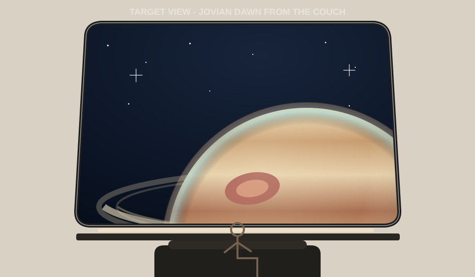
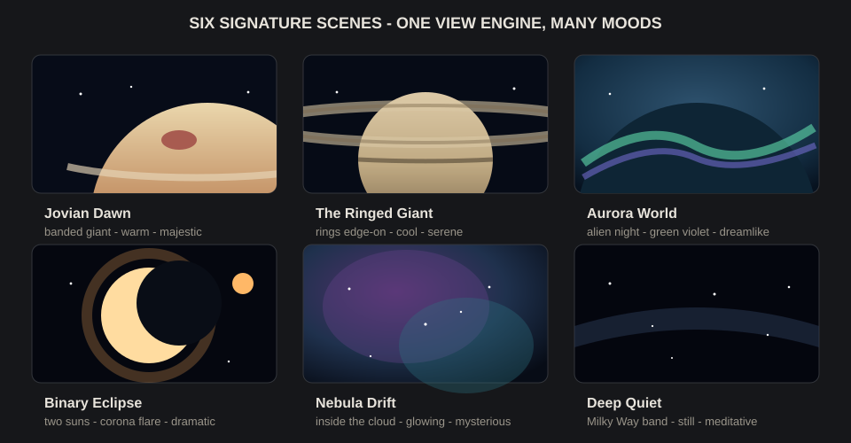
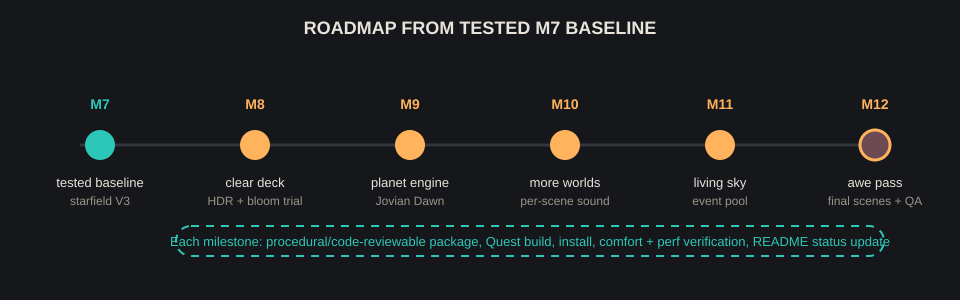

# Roadmap - Crew Quarters V2: The View

This roadmap continues from the Quarters V2 Milestone 9 fix6 beta headset build.

Current beta headset build:

- Stable rollback tag: `quarters-v2-m7-tested-20260711` points to the pre-M8 tested M7 build.
- Tested on: Meta Quest 3
- Installed/launched: 2026-07-12 22:55:28 JST
- Unity: 6000.5.2f1
- Package: `jp.openclaw.starshipcabin.beta`
- APK SHA-256: `77bd70d78426ca31c2f24b03d886a1c9e5534861b7ea0a5200c64319d360e17e`

## Direction

The next phase is tightly focused on visual awe and ambience:

- a world in the glass
- a menu of destinations
- a living sky
- per-world sound

Do not expand into movable objects, inventories, persistence, or room-memory features. The cabin should remain a comfort-first star-gazing space.

## Concept Panels

New Hope vision: [`docs/design/vision-the-getaway.html`](docs/design/vision-the-getaway.html)

### Target View

### Destination Moods

### Roadmap Flow

## Implemented

Milestones 1-9 are shipped and tested:

1. Shell + glazing: procedural Crew Quarters V2 shell, 55 degree glazed hull slope, four rounded-trapezoid window panes, shader starfield.
2. Furniture + palette: couch, bed, raised alcove, desk, console strips, plants, soft-bright material set.
3. Seat anchors: couch, bed-sit, bed-recline, and desk anchors with fade transitions.
4. URP + baked lighting: cove-lit baked GI, one mixed runtime light, legacy cleanup.
5. Audio V2 + media wall + star motion: layered ambient bed, brown noise, local video wall, lateral star motion, light fixes.
6. Decor pass: procedural chess set and library decor.
7. Book labels + starfield V3: fitted book labels and dark-sky star shader upgrade.
8. Clear the deck + HDR trial: retire the media/video wall, remove `MediaScreenController`, enable HDR + bloom, add fixed foveated rendering, and verify on Quest.
9. The planet: add `Jovian Dawn`, a procedural banded gas giant with storm, dawn terminator, atmospheric limb, and ring; reduce HDR-busy twinkle/lamp/reflection; keep destination switching for M10. Opus fix beta keeps the M7 star-plane geometry, makes the starfield a non-occluding background pass, keeps M8 HDR enabled, and lights Jovian Dawn toward the viewer.

The M5 media/video wall was retired because Quest system overlays can provide media apps without distracting from star-gazing.

## Beta-Integrated Milestones

### M10 - Destination Framework

- Added six slowly cross-faded gas-giant moods: `Jovian Dawn`, `The Ringed Giant`, `Ember`, `Pale Blue`, `Nebula Drift`, and `Deep Quiet`.
- Added per-destination planet/ring scale, palette, atmosphere, sun direction, and ambient-volume changes.
- Added public `Next()` and `SetDestination()` hooks for future controls.
- Still needed: bespoke world geometry, `Aurora World`, distinct per-world audio layers, and mixed-light integration.

Status: code-integrated on beta; editor regeneration and on-device pass condition remain pending.

### M11 - Living Sky Expansion

- Expanded the comfort-capped pool to a distant ship, comet, asteroid, lit station, and rare, slower Leviathan.
- Events remain slow, distant, sparse, and never head-triggered.
- Still needed: weighting, moon transits, meteor showers, and aurora ripples.

Status: code-integrated on beta; editor regeneration and on-device pass condition remain pending.

## New Hope — Quarters V2.0

The `newhope` branch extends the current beta as a third, independently installable Quest app:

- Product: `Starship Cabin New Hope`
- Android package: `jp.openclaw.starshipcabin.newhope`
- Build output: `Builds/StarshipCabin-Quarters-NewHope.apk`
- Base: beta commit `966e242`

### Integrated in code

- Destination colours now spill into the cabin through the mixed runtime light.
- A sleeping cat rests on the left couch cushion and breathes subtly.
- A warm sill-cove light pulses at approximately 5.5 breaths per minute.
- Arrival fades gently up from black; `SleepSession.BeginWindDown(minutes)` provides an opt-in fade/audio wind-down hook.
- An isolated experimental procedural drone sits underneath the existing ambient bed.

Status: code-integrated only. Unity regeneration, APK build, acoustic tuning, visual placement checks, comfort/performance QA, and Quest installation remain pending.

### Vision backlog

- Per-world generative spatial music and distinct sound layers.
- Moonrise, eclipse, aurora, ring-shadow, and other slow signature spectacles.
- Additional micro-motion and optional rest rituals.
- Passthrough portal and hand tracking as a focused OpenXR/device-side milestone.

The vision document is directional, not a claim that every depicted feature is implemented.

## Remaining Milestone

### M12 - Awe Pass

- Add `Binary Eclipse`.
- Replace the current `Nebula Drift` gas-giant mood with a bespoke destination if the frame budget permits.
- Keep the integrated rare `Leviathan` only if the core planet/sky experience works without it.
- Run a final comfort and performance sweep on Quest.

Pass condition: the full scene set still respects the comfort baseline and feels original, not derivative.

## Guardrails

- Comfort first: no artificial locomotion, no visible forced translation, no sudden large motion, no head-triggered sky events.
- Visual motion must stay vast, slow, and distant.
- Quest frame budget is authoritative. On-device testing decides.
- Geometry and shaders stay procedural/code-reviewable unless a later asset decision is explicit.
- Original sci-fi only: no franchise planets, ships, UI, sound effects, logos, or motifs.
- README must be updated with each implementation milestone so implemented status and roadmap status stay current.
